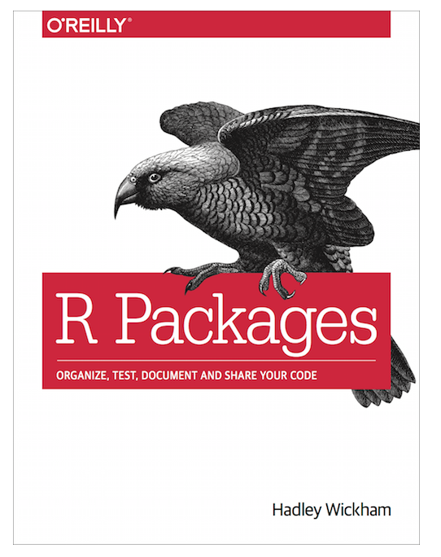
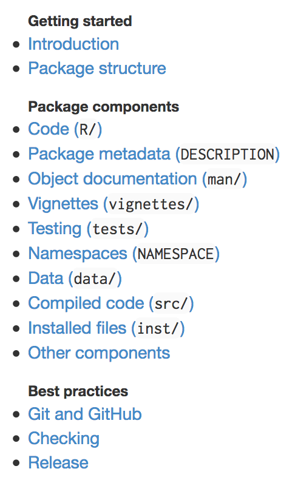
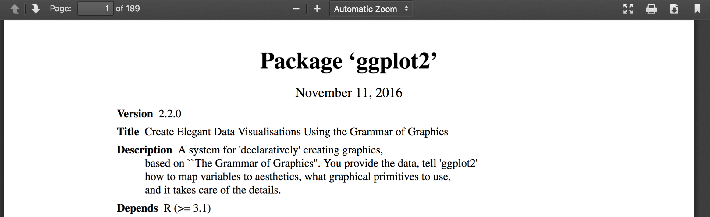
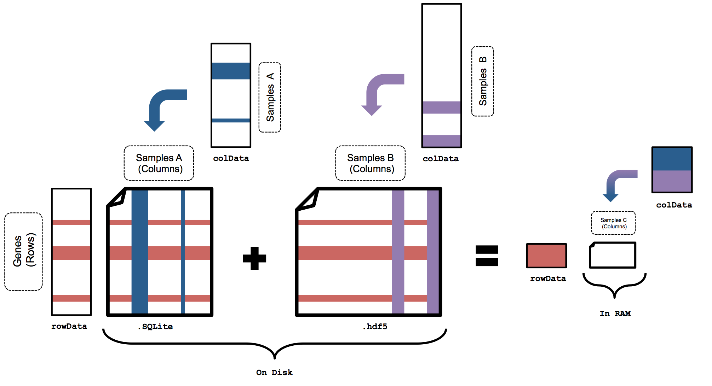
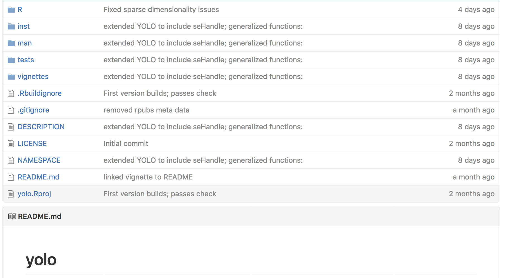

R packages
========================================================
author: Caleb Lareau
date: bit.ly/R_pkgs

Growth of R Packages
========================================================

<iframe src="growth.html" style="position:absolute;height:100%;width:100%"></iframe>

So should I hop on the bandwagon?
========================================================

A quick Google Search...
========================================================
"Should I write my own R package"

========================================================

But in reality...
========================================================

========================================================

How do I decide?
========================================================

========================================================

========================================================

Structure of an R Package
========================================================

Quick Start Guides
========================================================
- [Cat lady](https://hilaryparker.com/2014/04/29/writing-an-r-package-from-scratch/)
- [Iain Stott](https://methodsblog.wordpress.com/2015/11/30/building-your-first-r-package/)
- [Videos are nice](https://www.youtube.com/watch?v=9PyQlbAEujY)
      

Quick Start Guides
========================================================
- [Cat lady](https://hilaryparker.com/2014/04/29/writing-an-r-package-from-scratch/)
- [Iain Stott](https://methodsblog.wordpress.com/2015/11/30/building-your-first-r-package/)
- [Videos are nice](https://www.youtube.com/watch?v=9PyQlbAEujY)
      
But really, the only link you'll really ever need:
- [Hadley's Guide](http://r-pkgs.had.co.nz/)

In print
========================================================

Online too!
========================================================

What do I need to know?
========================================================
- [RStudio integration](https://support.rstudio.com/hc/en-us/articles/200486488-Developing-Packages-with-RStudio) is really great
- [devtools](https://github.com/hadley/devtools) makes your life easy
- [roxygen2](https://cran.r-project.org/web/packages/roxygen2/vignettes/roxygen2.html) keeps everything documented
- [testthat](https://github.com/hadley/testthat) keeps your robust with unit tests

Demo
=======================================================
- Executing [RStudio integration](https://support.rstudio.com/hc/en-us/articles/200486488-Developing-Packages-with-RStudio)
- Will use [this script](https://github.com/caleblareau/Rpkgs/blob/master/hello.R)
  
DEMO

Making a Help Manual
=======================================================

- Show how to compile one

Recent Example...
=======================================================

<iframe src="yolo_mem.html" style="position:absolute;height:100%;width:100%"></iframe>

Solution
=======================================================

Solution
=======================================================
- [yolo](https://github.com/caleblareau/yolo)

Publishing
=======================================================

- [Recent Paper](https://f1000research.com/articles/5-2122/v2)
- [Vignette](https://f1000research.com/articles/5-950/v2)

Benefits of F1000
=======================================================
  
- Straightforward to revise articles after publishing
  
- Peer-review also considered after article is posted
  
- Indexed on PubMed

So is this for me?
=======================================================

========================================================

Current
=======================================================
 
- Disorganized work
- New applications cause it to break
- You confuse yourself

Optimal
=======================================================
 
- Disorganized work -> Package Structure
- New applications cause it to break -> Unit Testing
- You confuse yourself -> Required Documentation
- Easy publication?
  
Is it worth the time investment?

Thanks!
=======================================================

=======================================================
