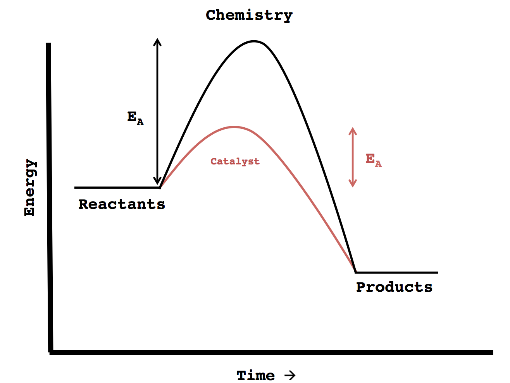
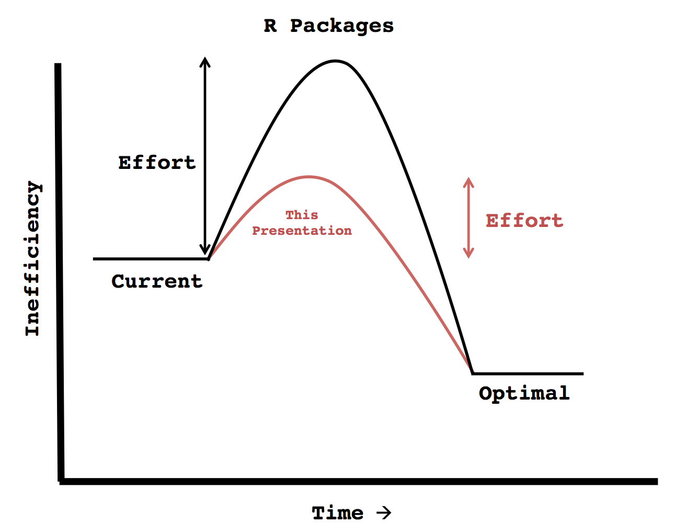
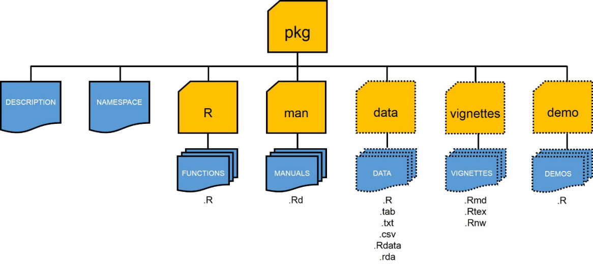
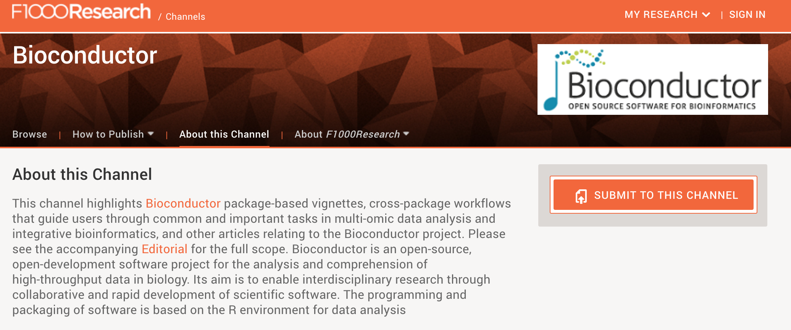

R packages
========================================================
author: Caleb Lareau
date: bit.ly/R_pkgs

Growth of R Packages
========================================================

<iframe src="growth.html" style="position:absolute;height:150%;width:150%"></iframe>

So should I hop on the bandwagon? 
========================================================

A quick Google Search... 
========================================================
"Should I write my own R package"
 
========================================================

But really...
========================================================

 
========================================================

How do I decide? 
========================================================

 
========================================================

========================================================

Structure of an R Package
========================================================

Quick Start Guides
========================================================
- [Cat lady](https://hilaryparker.com/2014/04/29/writing-an-r-package-from-scratch/)
- [Iain Stott](https://methodsblog.wordpress.com/2015/11/30/building-your-first-r-package/)
- [Videos are nice](https://www.youtube.com/watch?v=9PyQlbAEujY)
      

Quick Start Guides
========================================================
- [Cat lady](https://hilaryparker.com/2014/04/29/writing-an-r-package-from-scratch/)
- [Iain Stott](https://methodsblog.wordpress.com/2015/11/30/building-your-first-r-package/)
- [Videos are nice](https://www.youtube.com/watch?v=9PyQlbAEujY)
      
But really, the only link you'll really ever need: 
- [Hadley's Guide](http://r-pkgs.had.co.nz/)

Publishing
=======================================================

- [Recent Paper](https://f1000research.com/articles/5-2122/v2)
- [Vignette](https://f1000research.com/articles/5-950/v2)

Benefits of F1000
=======================================================
  
- Straightforward to revise articles after publishing
  
- Peer-review also considered after article is posted
  
- Indexed on PubMed
